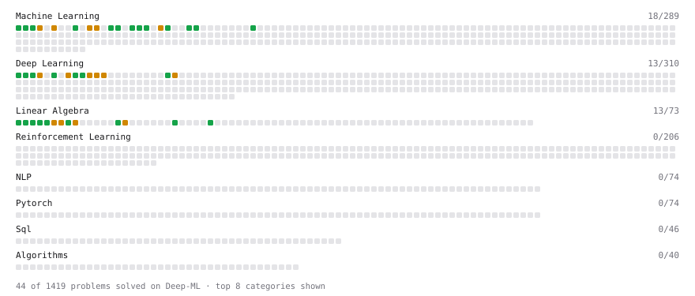

# Deep-ML

My machine learning practice from [Deep-ML](https://www.deep-ml.com). Every solution here was written by hand.

**59** solved · 59 problems · 0 labs · 0 math

[**Browse the interactive portfolio**](https://aymenboustani.github.io/deep-ml/) to replay this filling in over time.

## Problems

| | Difficulty | Solved | |
| --- | --- | --- | --- |
| [Calculate 2x2 Matrix Inverse](https://www.deep-ml.com/problems/8) | easy | 2024-09-01 | [solution](problems/0008-calculate-2x2-matrix-inverse) |
| [Calculate Accuracy Score](https://www.deep-ml.com/problems/36) | easy | 2024-08-23 | [solution](problems/0036-calculate-accuracy-score) |
| [Calculate Cosine Similarity Between Vectors](https://www.deep-ml.com/problems/76) | easy | 2025-03-28 | [solution](problems/0076-calculate-cosine-similarity-between-vectors) |
| [Calculate Image Brightness](https://www.deep-ml.com/problems/70) | easy | 2025-03-27 | [solution](problems/0070-calculate-image-brightness) |
| [Calculate Mean Absolute Error (MAE)](https://www.deep-ml.com/problems/93) | easy | 2025-02-01 | [solution](problems/0093-calculate-mean-absolute-error-mae) |
| [Calculate Mean by Row or Column](https://www.deep-ml.com/problems/4) | easy | 2024-07-12 | [solution](problems/0004-calculate-mean-by-row-or-column) |
| [Calculate R-squared for Regression Analysis](https://www.deep-ml.com/problems/69) | easy | 2025-02-01 | [solution](problems/0069-calculate-r-squared-for-regression-analysis) |
| [Calculate Root Mean Square Error (RMSE)](https://www.deep-ml.com/problems/71) | easy | 2025-02-01 | [solution](problems/0071-calculate-root-mean-square-error-rmse) |
| [Calculate the Phi Coefficient](https://www.deep-ml.com/problems/95) | easy | 2025-03-27 | [solution](problems/0095-calculate-the-phi-coefficient) |
| [Convert Vector to Diagonal Matrix](https://www.deep-ml.com/problems/35) | easy | 2024-08-22 | [solution](problems/0035-convert-vector-to-diagonal-matrix) |
| [Dot Product Calculator](https://www.deep-ml.com/problems/83) | easy | 2025-02-01 | [solution](problems/0083-dot-product-calculator) |
| [Feature Scaling Implementation](https://www.deep-ml.com/problems/16) | easy | 2024-07-12 | [solution](problems/0016-feature-scaling-implementation) |
| [Generate a Confusion Matrix for Binary Classification](https://www.deep-ml.com/problems/75) | easy | 2025-03-27 | [solution](problems/0075-generate-a-confusion-matrix-for-binary-classification) |
| [Implement F-Score Calculation for Binary Classification](https://www.deep-ml.com/problems/61) | easy | 2025-03-29 | [solution](problems/0061-implement-f-score-calculation-for-binary-classification) |
| [Implement Orthogonal Projection of a Vector onto a Line](https://www.deep-ml.com/problems/66) | easy | 2025-02-01 | [solution](problems/0066-implement-orthogonal-projection-of-a-vector-onto-a-line) |
| [Implement Precision Metric](https://www.deep-ml.com/problems/46) | easy | 2024-08-29 | [solution](problems/0046-implement-precision-metric) |
| [Implement Recall Metric in Binary Classification](https://www.deep-ml.com/problems/52) | easy | 2025-02-01 | [solution](problems/0052-implement-recall-metric-in-binary-classification) |
| [Implement ReLU Activation Function](https://www.deep-ml.com/problems/42) | easy | 2024-08-22 | [solution](problems/0042-implement-relu-activation-function) |
| [Implement Ridge Regression Loss Function](https://www.deep-ml.com/problems/43) | easy | 2024-08-23 | [solution](problems/0043-implement-ridge-regression-loss-function) |
| [Implement the ELU Activation Function](https://www.deep-ml.com/problems/97) | easy | 2025-02-02 | [solution](problems/0097-implement-the-elu-activation-function) |
| [Implement the Softplus Activation Function](https://www.deep-ml.com/problems/99) | easy | 2025-03-28 | [solution](problems/0099-implement-the-softplus-activation-function) |
| [Implement the Swish Activation Function](https://www.deep-ml.com/problems/102) | easy | 2025-03-28 | [solution](problems/0102-implement-the-swish-activation-function) |
| [Implementation of Log Softmax Function](https://www.deep-ml.com/problems/39) | easy | 2024-08-22 | [solution](problems/0039-implementation-of-log-softmax-function) |
| [KL Divergence Between Two Normal Distributions](https://www.deep-ml.com/problems/56) | easy | 2025-03-28 | [solution](problems/0056-kl-divergence-between-two-normal-distributions) |
| [Leaky ReLU Activation Function](https://www.deep-ml.com/problems/44) | easy | 2024-08-22 | [solution](problems/0044-leaky-relu-activation-function) |
| [Linear Kernel Function](https://www.deep-ml.com/problems/45) | easy | 2024-08-23 | [solution](problems/0045-linear-kernel-function) |
| [Linear Regression Using Gradient Descent](https://www.deep-ml.com/problems/15) | easy | 2024-09-02 | [solution](problems/0015-linear-regression-using-gradient-descent) |
| [Linear Regression Using Normal Equation](https://www.deep-ml.com/problems/14) | easy | 2024-07-12 | [solution](problems/0014-linear-regression-using-normal-equation) |
| [Matrix-Vector Dot Product](https://www.deep-ml.com/problems/1) | easy | 2024-07-10 | [solution](problems/0001-matrix-vector-dot-product) |
| [Min-Max Scaling of Feature Values](https://www.deep-ml.com/problems/112) | easy | 2025-03-28 | [solution](problems/0112-min-max-scaling-of-feature-values) |
| [One-Hot Encoding of Nominal Values](https://www.deep-ml.com/problems/34) | easy | 2024-08-22 | [solution](problems/0034-one-hot-encoding-of-nominal-values) |
| [Poisson Distribution Probability Calculator](https://www.deep-ml.com/problems/81) | easy | 2025-03-28 | [solution](problems/0081-poisson-distribution-probability-calculator) |
| [Random Shuffle of Dataset](https://www.deep-ml.com/problems/29) | easy | 2024-07-26 | [solution](problems/0029-random-shuffle-of-dataset) |
| [Reshape Matrix](https://www.deep-ml.com/problems/3) | easy | 2024-08-23 | [solution](problems/0003-reshape-matrix) |
| [Scalar Multiplication of a Matrix](https://www.deep-ml.com/problems/5) | easy | 2024-07-12 | [solution](problems/0005-scalar-multiplication-of-a-matrix) |
| [Sigmoid Activation Function Understanding](https://www.deep-ml.com/problems/22) | easy | 2024-07-12 | [solution](problems/0022-sigmoid-activation-function-understanding) |
| [Single Neuron](https://www.deep-ml.com/problems/24) | easy | 2024-07-12 | [solution](problems/0024-single-neuron) |
| [Softmax Activation Function Implementation ](https://www.deep-ml.com/problems/23) | easy | 2024-07-12 | [solution](problems/0023-softmax-activation-function-implementation) |
| [Transpose of a Matrix](https://www.deep-ml.com/problems/2) | easy | 2024-07-12 | [solution](problems/0002-transpose-of-a-matrix) |
| [Adam Optimizer](https://www.deep-ml.com/problems/87) | medium | 2025-03-28 | [solution](problems/0087-adam-optimizer) |
| [Calculate Correlation Matrix](https://www.deep-ml.com/problems/37) | medium | 2024-08-29 | [solution](problems/0037-calculate-correlation-matrix) |
| [Calculate Eigenvalues of a Matrix](https://www.deep-ml.com/problems/6) | medium | 2024-08-22 | [solution](problems/0006-calculate-eigenvalues-of-a-matrix) |
| [Calculate Performance Metrics for a Classification Model](https://www.deep-ml.com/problems/77) | medium | 2025-03-29 | [solution](problems/0077-calculate-performance-metrics-for-a-classification-model) |
| [Compute Pointwise Mutual Information](https://www.deep-ml.com/problems/111) | medium | 2025-03-28 | [solution](problems/0111-compute-pointwise-mutual-information) |
| [Divide Dataset Based on Feature Threshold](https://www.deep-ml.com/problems/31) | medium | 2024-08-30 | [solution](problems/0031-divide-dataset-based-on-feature-threshold) |
| [Generate Sorted Polynomial Features](https://www.deep-ml.com/problems/32) | medium | 2024-09-05 | [solution](problems/0032-generate-sorted-polynomial-features) |
| [Implement Adam Optimization Algorithm](https://www.deep-ml.com/problems/49) | medium | 2024-09-06 | [solution](problems/0049-implement-adam-optimization-algorithm) |
| [Implement Lasso Regression using ISTA](https://www.deep-ml.com/problems/50) | medium | 2024-09-10 | [solution](problems/0050-implement-lasso-regression-using-ista) |
| [Implement PReLU Forward and Backward Pass](https://www.deep-ml.com/problems/98) | medium | 2025-02-02 | [solution](problems/0098-implement-prelu-forward-and-backward-pass) |
| [Implement Self-Attention Mechanism](https://www.deep-ml.com/problems/53) | medium | 2025-02-01 | [solution](problems/0053-implement-self-attention-mechanism) |
| [Implementing a Simple RNN](https://www.deep-ml.com/problems/54) | medium | 2025-02-01 | [solution](problems/0054-implementing-a-simple-rnn) |
| [K-Means Clustering](https://www.deep-ml.com/problems/17) | medium | 2024-08-29 | [solution](problems/0017-k-means-clustering) |
| [Matrix times Matrix ](https://www.deep-ml.com/problems/9) | medium | 2024-09-04 | [solution](problems/0009-matrix-times-matrix) |
| [Matrix Transformation ](https://www.deep-ml.com/problems/7) | medium | 2024-09-04 | [solution](problems/0007-matrix-transformation) |
| [Normal Distribution PDF Calculator](https://www.deep-ml.com/problems/80) | medium | 2025-03-29 | [solution](problems/0080-normal-distribution-pdf-calculator) |
| [Principal Component Analysis (PCA) Implementation](https://www.deep-ml.com/problems/19) | medium | 2024-09-05 | [solution](problems/0019-principal-component-analysis-pca-implementation) |
| [Simple Convolutional 2D Layer](https://www.deep-ml.com/problems/41) | medium | 2024-09-02 | [solution](problems/0041-simple-convolutional-2d-layer) |
| [Single Neuron with Backpropagation](https://www.deep-ml.com/problems/25) | medium | 2024-09-02 | [solution](problems/0025-single-neuron-with-backpropagation) |
| [Positional Encoding Calculator](https://www.deep-ml.com/problems/85) | hard | 2025-03-29 | [solution](problems/0085-positional-encoding-calculator) |

---

_This file is regenerated by Deep-ML on every push._
